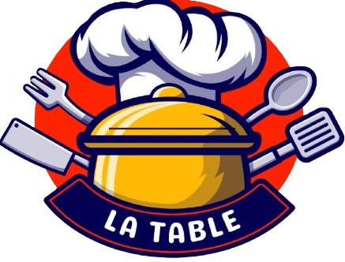
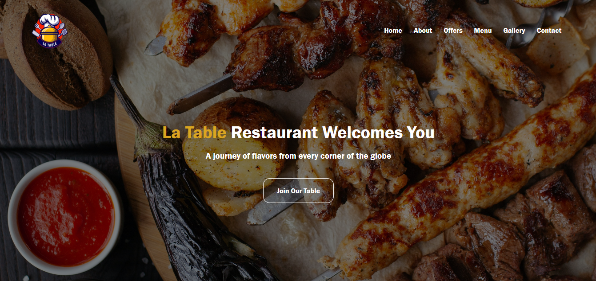
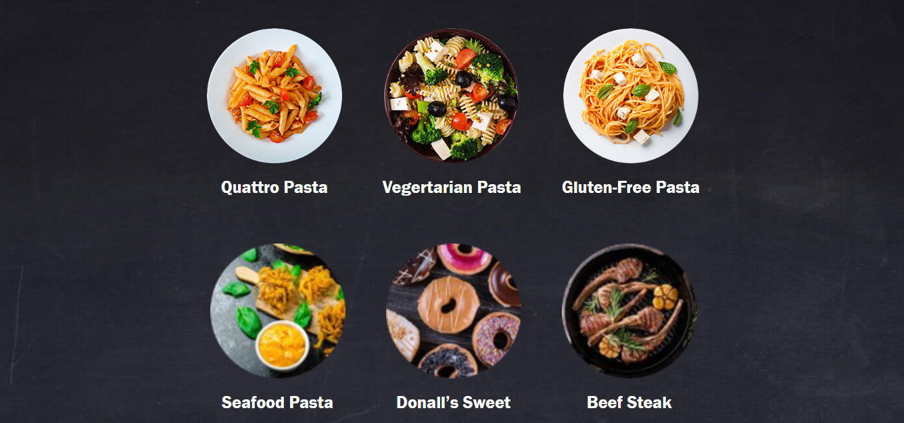
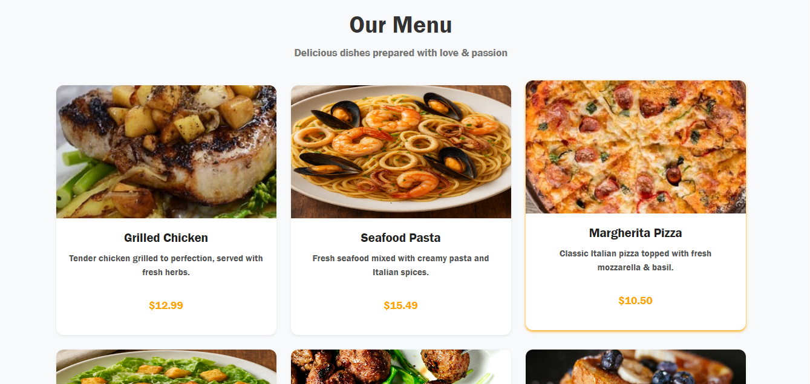
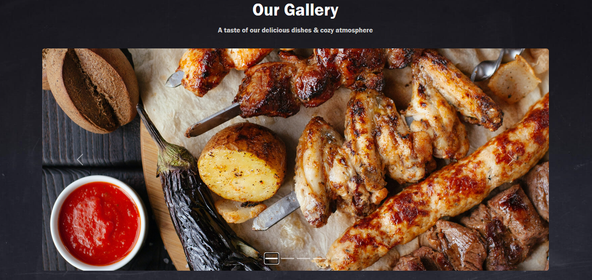

# 🍽 La Table Restaurant Website



## Overview
La Table is a fine dining restaurant website showcasing its history, menu, special offers, gallery, and contact information. Built with **HTML**, **CSS**, and **Bootstrap 5**, it offers a responsive design for both desktop and mobile users.

## 🚀 Features
- **Home Section:** Welcoming intro with a call-to-action button.
- **About Section:** Restaurant history with an image.
- **Offers Section:** Special dishes with images.
- **Menu Section:** Delicious dishes with images, descriptions, and prices.
- **Gallery Section:** Carousel of food images.
- **Contact Section:** Contact info and a functional form.
- **Footer:** Quick links, opening hours, social media icons.

## 📂 Project Structure
```text
La-Table/
│
├── img/
│ ├── logo.png
│ ├── about_img.png
│ ├── offer1.png
│ ├── offer2.png
│ ├── offer3.png
│ ├── food2.png
│ ├── food4.png
│ ├── food5.png
│ ├── food9.jpeg
│ ├── food11.jpeg
│ ├── food12.jpeg
│ ├── menu3.png
│ ├── menu4.png
│ ├── gallery1.jpeg
│ ├── gallery2.jpeg
│ ├── gallery3.jpeg
│ ├── gallery4.jpeg
│ ├── gallery6.jpeg
│
├── style.css
├── index.html
└── README.md
```

## How to Run
1. Clone the repository:
   ```bash
   git clone https://github.com/ahmedtalaat-dev/la-table-restaurant.git
   ```
2. Open index.html in your preferred browser.

## 📸 Screenshots

### Home Section


### Offers Section


### Menu Section


### Gallery Section


## 🛠 Technologies Used

- **HTML5** – Markup language used to structure the website.  
- **CSS3** – Styling language to make the website visually appealing.  
- **Bootstrap 5** – Responsive framework for layout and components.  
- **Font Awesome 6** – Icon library for social media and UI icons.

## 👓 Author

**Ahmed Talaat**  
Website & Design: *La Table Restaurant*

## 🌐 Live Website

Check out the live website here: [La Table Restaurant](https://your-live-website-link.com)
